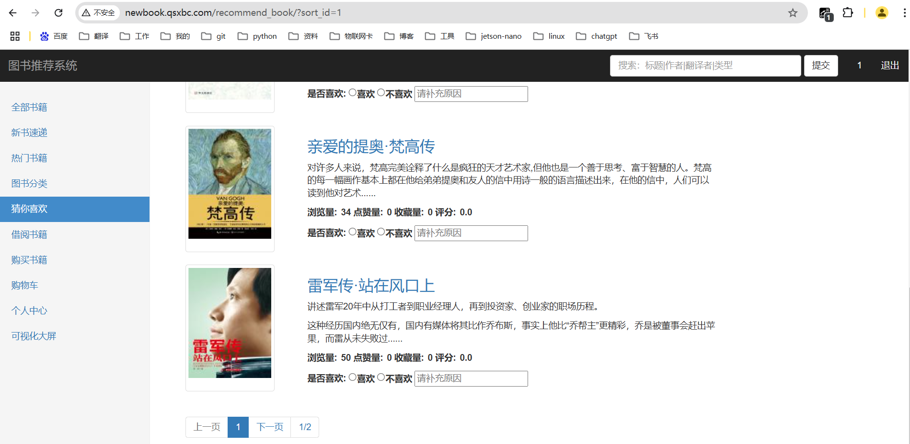

# 基于word2vec的推荐系统

#### 介绍
基于word2vec的推荐系统
可用于推荐商品，图书，电影，课程，旅游景点，音乐…


## 效果




```
网站：http://newbook.qsxbc.com/
微信：1257309054
```


## 一、word2vec简介

Word2Vec是一种词向量表示方法，是在自然语言处理领域（NLP）的神经网络模型，包含两种模型架构：**CBOW模型**与**Skip-Gram模型**。

常用于：**相似度计算**、**词类聚类**、**文本分类**、**句子和文档表示**、搜索引擎优化、情感分析、主题建模以及问答系统。


## 二、对英文句子进行处理

```
流程：
1、获取数据
2、预处理
3、训练Word2Vec模型
4、预测并推荐
```

假设目前有十本图书数据，有标题与内容简介，目标：给定一个新的图书数据，然后预测与其相近的图书。

### 1、安装库

```python
pip install gensim
pip install nltk==3.8.1
```

下载对应的`punkt`用于分词，`stopwords`用于去掉停用词。

[点我下载](https://download.csdn.net/download/lm_is_dc/90224190)

也可以在github下载nltk的数据：

[点我下载](https://github.com/nltk/nltk_data)

下载完成后，放到`C:\Users\用户\nltk_data`下。


## 三、对中文句子进行处理

### 1、安装库

```
pip install gensim
pip install jieba
```


## 四、基于Word2Vec的图书推荐系统

效果：

[网址点我跳转](http://newbook.qsxbc.com/)


